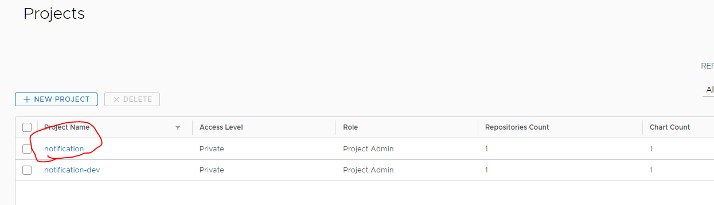
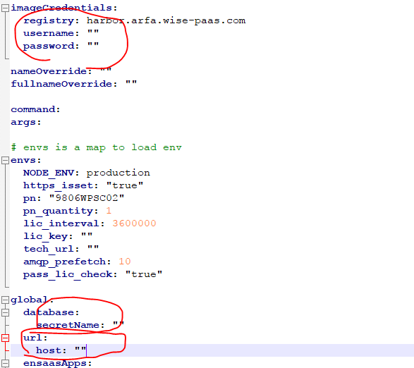

# 手動佈署已發佈notification教學

1. 確認3要素 (k8sCfg/secret/license)
2. 準備helm install value檔案
3. 使用helm install佈署datahub
4. 使用kubectl檢查佈署狀態
5. 用External URL從瀏覽器訪問Notification portal

## Prerequisite

* helm v3.x
* kubectl v1.x

## Step 1. 確認3要素 (k8sCfg/secret/license)

* 取得正確的K8S Cluster Config
  * 請確保此Config指向正確的datacenter/cluster/namespace
  * 請在k8s Config裡填好namespace, 避免每次下指令都要指定, 錯誤率高
* 確認或建立Notification所需的多合一secret為何
  * Notification所需的service規則為
    * 必要服務為有rabbitmq/pg這兩個
    * pg需有g_notification role
  * 如果沒有, 請找平台的人建立secret, 目前都是找展豪
* 確認或建立datahub所需的license
  * 確認方式是用此api
    * [https://api-license-master.es.wise-paas.cn/v1/api/partNum/licenseQty?pn=9806WPSC02\&id=slave0420a957f4-0bf9-4faf-90cd-694919cd4b68scada](https://api-license-master.es.wise-paas.cn/v1/api/partNum/licenseQty?pn=9806WPSC02\&id=slave0420a957f4-0bf9-4faf-90cd-694919cd4b68scada)
      * 此範例為es站點, 請視不同站點修改url/datahub pn, notification pn目前固定為9806WPSC02
      * id規則為:clustername+workspaceId+namespaceName（不含+）
  * 目前平台窗口為文靜
  * **注意!如果只是測試用途**, 且你非常肯定繞過license檢查是沒問題的, 請詢問Steven如何繞過

## Step 2. 準備helm install value檔案

* 請至林口Harbor的notification project複製一份對應版本之value yaml預設檔\
  
* 此份value.yaml只需要修改以下幾項
  * imageCredentials
    * 林口harbor的帳號密碼, 才能pull portal和worker的image
  * global.database.secretName
    * Step1提到的多合一secret name
  * global.url.host
    * 依據`.$namespace.$cluster.internal`這個規則去填寫



## Step 3. 使用helm install佈署Notification

* 將chart repo在本機註冊, 指令中的datahub參數是註冊於本機的別名
  * `helm repo add --username USER --password PWD datahub https://harbor.arfa.wise-paas.com/chartrepo/notification`
* 使用`helm install`配合Step2之value.yaml佈署datahub到k8s上
  * `helm install notification notification/notification --version 1.1.0 -f value.yaml`
    * 第一個參數notification是指佈到k8s上此chart的別名
    * notification/notification對應到的是HARBOR-PROJECT/CHART-NAME

## Step 4. 使用kubectl檢查佈署狀態

```
## 列出所有佈到k8s上的helm chart
helm ls

## 列出某一個install完的chart狀態
helm CHART_NAME status

## 列出所有pod (可透過-n指定namespace, 或是直接在k8s config指定namespace)
kubectl get pod

## 列出pod的log
kubectl log POD_NAME
```

## Step 5. 用External URL從瀏覽器訪問Datahub portal

* 外部規則為
  * `https://portal-notification-$namespace-$cluster.$datacenterExternalDomain/`
  * $datacenterExternalDomain是每個站點各自不同的external domain
    * sa的就是sa.wise-paas.com
    * 細節可以參考 [http://api-listingsystem-master.es.wise-paas.cn/v1/datacenter](https://api-listingsystem-ensaas.sa.wise-paas.com/v1/datacenter)

_**強烈建議**_

因為要自己組外部url太麻煩了, 各個站點的domain也都不同, 如果該站點route-api有work, 可直接call api拿外部url

流程為

* kubectl get ingress notification
* 拿到internal url: portal-notification.ifactory.eks002.en.internal
* 呼叫 GET [https://api-router-ensaas.sa.wise-paas.com/v1/routers/domain/INGRESS-INTERNAL-URL/external](https://api-router-ensaas.sa.wise-paas.com/v1/routers/domain/INGRESS-INTERNAL-URL/external)
  * ex. [https://api-router-ensaas.sa.wise-paas.com/v1/routers/domain/portal-notification.ifactory.eks002.en.internal/external](https://api-router-ensaas.sa.wise-paas.com/v1/routers/domain/portal-notification.ifactory.eks002.en.internal/external)
* 返回結果裡的data就是外部url
